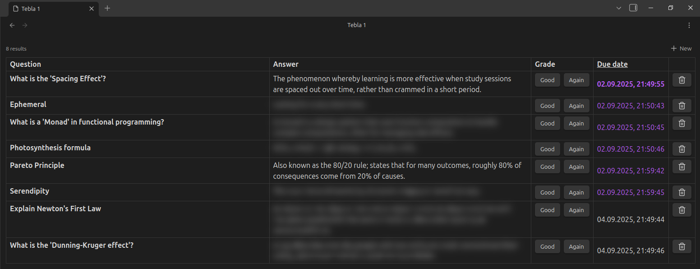

# What is this?
Obsidian plugin for spaced repetition.

# Why is it named this way?
`Table` with the vowel order as in `learn`.

# Why?
I want to see a list of questions in a table format and be able to manage questions and answer them through the table. In all programs (anki, mochi cards, various obsidian plugins) these 2 processes are separated.

